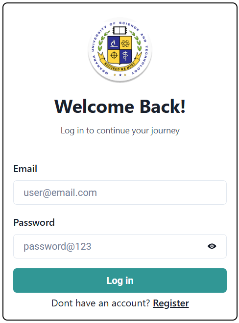
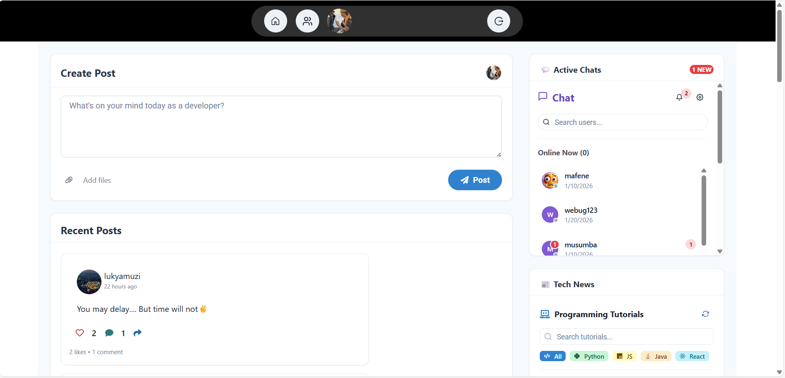

# DevFollow  
### A Social Coding Platform for Students

## Live Demo
- **Hosting URL:** https://devfellowmust.web.app  
- **GitHub Repository:** https://github.com/MusumbaAbeljr055/DevFollow

---

##  Project Description
DevFollow is a student-centered social coding platform designed to **eliminate fear and anxiety about programming**.

It allows students to post coding problems, ask questions, share solutions, comment on posts, and learn together in a supportive environment just like social media, but for **programming education**.

---

## Project Objectives
- Reduce fear and intimidation around programming
- Encourage students to ask questions freely
- Promote peer-to-peer learning and mentorship
- Build confidence through collaboration
- Create a friendly coding community for students

---

##  Features
- Secure user authentication (Firebase Authentication)
- Protected routes for authenticated users
- Create, like, comment, and repost coding posts
- Real-time chat between followers
- Follow and unfollow users
- Profile customization (image, bio)
- Real-time updates using Firebase Firestore
- Modern UI built with Chakra UI

---
### 🔐 Authentication

  

###  Dashboard

  

## Technologies Used
- **Frontend:** React (Vite)
- **UI Framework:** Chakra UI
- **Backend & Database:** Firebase Firestore
- **Authentication:** Firebase Auth
- **Hosting:** Firebase Hosting
- **Version Control:** Git & GitHub

---

## Developer
**Developed by:**  
**Ssenkubuge Abbey Musumba**

---

## 📜 License
This project was developed for educational and academic purposes.
